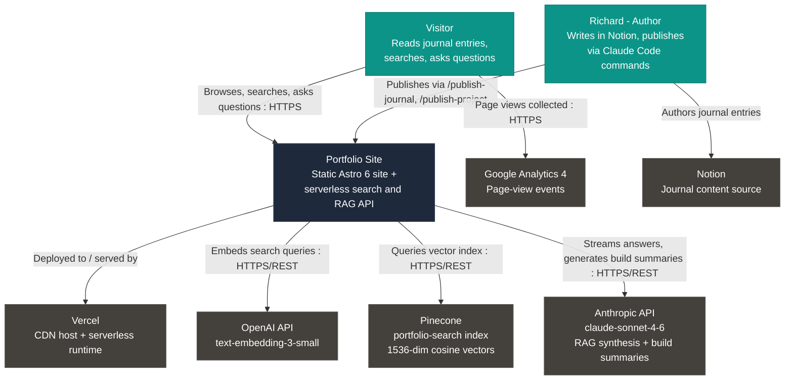
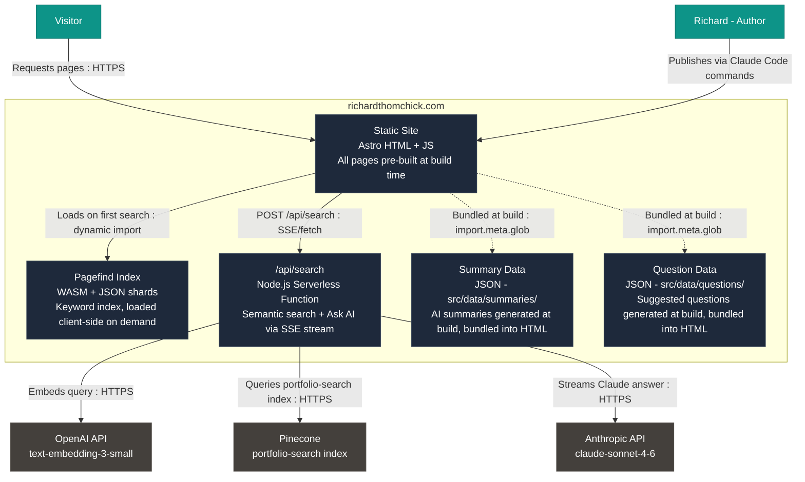
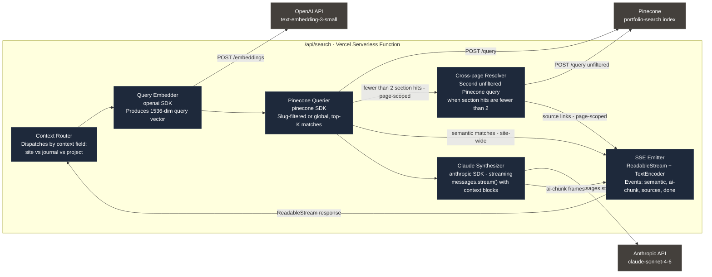
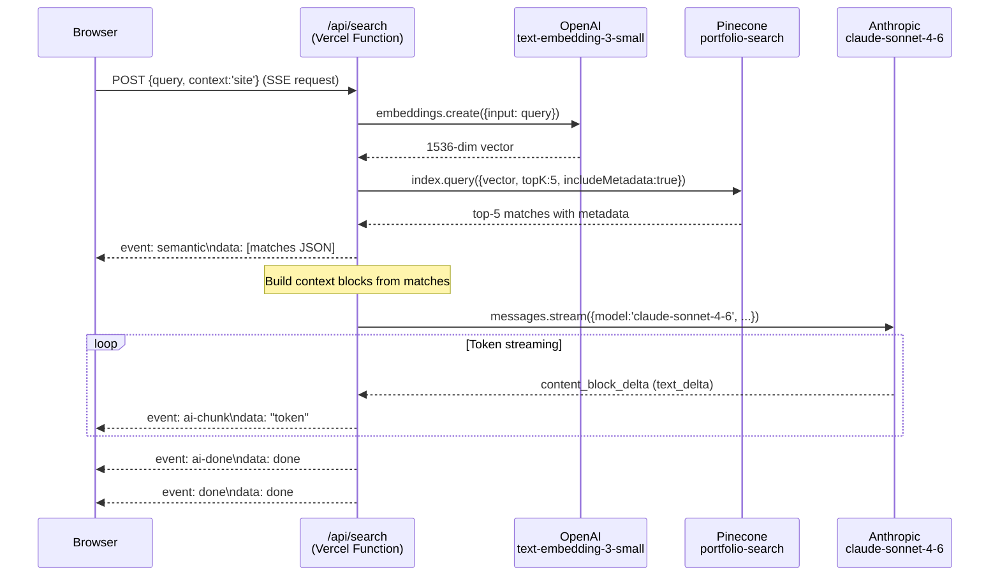
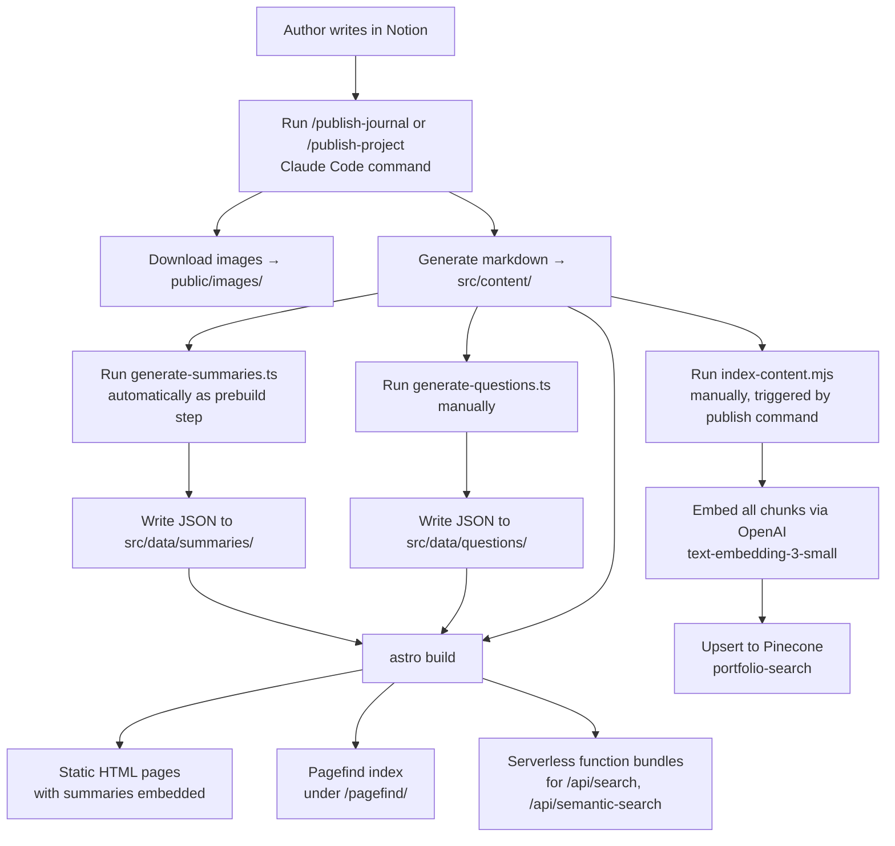
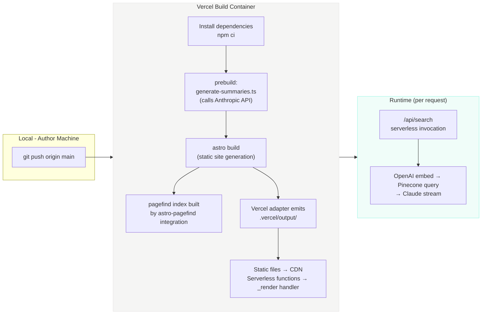

# Technical Overview — richardthomchick.com

> Last updated: 2026-05-28. All claims are grounded in source files; file references appear inline.

---

## Executive Summary

richardthomchick.com is a statically generated personal portfolio site built with Astro 6 and deployed to Vercel. The notable engineering bets are concentrated in the search layer: a three-tier search system that runs Pagefind keyword search and a serverless semantic search call in parallel, then synthesizes a streamed Claude RAG answer over the same HTTP response. Every journal entry and project page also exposes a page-scoped "Ask AI" panel backed by the same serverless function, filtered by content slug, with multi-turn conversation history. AI-generated summaries and suggested questions are produced at build time and baked into the static HTML, keeping the interactive panels fast without a round-trip for the initial render.

---

## Technology Stack

| Layer | Technology | Version |
|---|---|---|
| Framework | Astro | 6.1.5 |
| Styling | Tailwind CSS 4 + @tailwindcss/typography | 4.2.2 / 0.5.19 |
| Hosting | Vercel (via `@astrojs/vercel`) | adapter 10.0.4 |
| Serverless runtime | Node.js | ≥ 22.12.0 |
| Search index (keyword) | Pagefind (via `astro-pagefind`) | 2.0.0 |
| Vector database | Pinecone | SDK 7.2.0 |
| Embedding model | OpenAI `text-embedding-3-small` (1536 dims) | SDK 6.38.0 |
| LLM (RAG synthesis) | Anthropic Claude Sonnet 4.6 | SDK 0.97.1 |
| LLM (build-time summaries) | Anthropic Claude Sonnet 4.6 / Haiku 4.5 | SDK 0.97.1 |
| Analytics | Google Analytics 4 (G-N2265LHX8B) + Vercel Speed Insights | — |
| Fonts / Icons | DM Sans (Google Fonts), Tabler Icons (CDN) | — |

Sources: [`package.json`](package.json), [`astro.config.mjs`](astro.config.mjs), [`scripts/generate-summaries.ts`](scripts/generate-summaries.ts), [`src/layouts/BaseLayout.astro`](src/layouts/BaseLayout.astro).

---

## System Architecture

### Level 1: System Context

### Level 2: Container

> `/api/semantic-search` (legacy non-streaming endpoint, not wired to any current UI) is omitted from this diagram for clarity. See the Rendering Model section.

---

## Rendering Model

The Astro config ([`astro.config.mjs`](astro.config.mjs)) sets `output: 'static'` — the entire site is statically generated at build time. All content pages (home, journal, projects, about, search shell) are pre-built HTML files served directly from Vercel's edge CDN.

The two API routes (`src/pages/api/search.ts`, `src/pages/api/semantic-search.ts`) opt out of prerendering with `export const prerender = false`, which causes the `@astrojs/vercel` adapter to emit them as Vercel serverless functions. This is reflected in the generated `.vercel/output/config.json`, which routes `/api/search` and `/api/semantic-search` to the `_render` handler. All other URLs are served from the filesystem (static).

The practical outcome is that pages are fast and cacheable without configuration; only search/RAG operations require a runtime compute hit. There is no server-side rendering for content pages — no dynamic personalization, no edge runtime.

---

## Search Architecture

The site runs a three-tier search stack: keyword → semantic → RAG synthesis. Tiers 2 and 3 share a single HTTP connection via SSE.

### Tier 1 — Pagefind (keyword, client-side)

At build time, `astro-pagefind` crawls all pages annotated with `data-pagefind-body` and generates a WASM-based index under `/pagefind/`. On the search page ([`src/pages/search.astro`](src/pages/search.astro)), Pagefind is loaded on first search via a dynamic ES module import (`import('/pagefind/pagefind.js')`). Up to ten results are returned with pre-highlighted `<mark>` excerpts.

### Tier 2 — Semantic Search (OpenAI → Pinecone, server-side)

A `POST /api/search` call with `context: 'site'` is fired in parallel with Pagefind. The serverless function ([`src/pages/api/search.ts`](src/pages/api/search.ts)):
1. Embeds the query with `text-embedding-3-small`.
2. Queries the `portfolio-search` Pinecone index (`topK: 5`).
3. Emits the top matches immediately as an `event: semantic` SSE frame.

The client merges keyword and semantic results by URL, deduplicating hits that appear in both, and renders the merged list.

### Tier 3 — RAG Answer Synthesis (Claude, server-side, streaming)

Without breaking the same SSE connection, the function continues by passing the top-5 Pinecone matches as context blocks to `claude-sonnet-4-6` (`max_tokens: 1024`). The model streams its answer token-by-token as `event: ai-chunk` frames. The client appends tokens to an "AI answer" card in real time. When streaming completes, an `event: ai-done` frame is sent.

### Page-scoped Ask AI

Journal and project pages expose an "Ask AI" panel via [`src/components/ContentActions.astro`](src/components/ContentActions.astro). It calls the same `/api/search` endpoint with `context: 'journal'` or `context: 'project'` and the current page's slug. The function narrows the Pinecone query with a metadata filter (`filter: { slug: { '$eq': slug } }`, `topK: 6`). If fewer than two section hits are returned, a second unfiltered query (`topK: 4`) finds cross-page related content. Claude then streams an answer scoped to the page (persona: "first person as Richard"), with up to three prior Q&A turns passed as conversation history.

### Level 3: Search Function Components

### RAG Query Sequence — "Ask AI" Path (Site-wide)

---

## Content Pipeline

### Content Structure

Content lives in two Astro content collections ([`src/content.config.ts`](src/content.config.ts)):

- **`journal`** — 13 markdown files in `src/content/journal/`, each with `title`, `headline`, `week`, `date`, `summary`, `goal`, `tags`, `keyInsights`, `toolsBuilt`, `status` frontmatter fields.
- **`projects`** — 9 markdown files in `src/content/projects/`, each with `title`, `description`, `status`, `weekBuilt`, `tags`, `problemSolved`, `architecturePattern`, `techStack`, `sortOrder`, and optional `deployUrl`/`repoUrl`.

### Build-time Enrichment

Before each Astro build, a `prebuild` npm script ([`package.json`](package.json) `scripts.prebuild`) runs [`scripts/generate-summaries.ts`](scripts/generate-summaries.ts). This script:
- Reads every markdown file in `src/content/journal/` and `src/content/projects/`.
- Skips files whose JSON output is newer than the source markdown (incremental).
- Calls Claude Sonnet 4.6 (journal entries) or Claude Haiku 4.5 (project pages) to generate a structured JSON summary: an `overview` string (≤280 chars) and 3–5 `keyPoints` anchored to heading IDs.
- Writes output to `src/data/summaries/` and `src/data/summaries/projects/`.

A separate [`scripts/generate-questions.ts`](scripts/generate-questions.ts) generates 3 suggested questions per entry using Claude Haiku 4.5. This script is **not** part of the automated build — it must be run manually (`npx tsx scripts/generate-questions.ts`) and its output lives in `src/data/questions/`.

At build time, both data directories are imported into the journal and project slug pages via `import.meta.glob`, bundled into the static HTML as JSON in `<script type="application/json">` tags, and rendered client-side with zero runtime API calls.

### Reading Time

Word count and reading time (words / 200, minimum 1 minute) are computed inline in [`src/pages/journal/[...slug].astro`](src/pages/journal/[...slug].astro:41) at build time and rendered directly into the HTML.

### Content Pipeline Flow

---

## Deployment Pipeline

Vercel serves as both CI and CDN. There is no separate CI pipeline — pushes to `main` trigger an automatic Vercel build.

**Build-time work:** Astro content collection processing, markdown rendering, `import.meta.glob` data bundling, Tailwind CSS compilation, Pagefind index generation, sitemap XML, summary generation via Anthropic API.

**Request-time work:** `/api/search` — query embedding, vector lookup, Claude streaming. Everything else is served statically with no compute cost per request.

The Vercel output configuration (`.vercel/output/config.json`, generated by the adapter) routes `/api/search` and `/api/semantic-search` to the serverless handler; all other paths fall through to the filesystem or return a static 404.

---

## Data & Embeddings

### Pinecone Index

| Parameter | Value |
|---|---|
| Index name | `portfolio-search` |
| Dimension | 1536 |
| Metric | Cosine (Pinecone default for OpenAI embeddings) |
| Embedding model | `text-embedding-3-small` |

Sources: [`scripts/index-content.mjs`](scripts/index-content.mjs), [`src/pages/api/search.ts`](src/pages/api/search.ts).

### What Gets Embedded

[`scripts/index-content.mjs`](scripts/index-content.mjs) reads all `.md` files from `src/content/journal/` and `src/content/projects/`. For each file:

1. **Chunk by H2 headings** — the body is split at `## ` boundaries. Each heading section becomes a chunk.
2. **Oversized sections** — sections longer than 3200 characters (~800 tokens) are split further at paragraph boundaries, with 100-character overlap for context continuity.
3. **Code block stripping** — fenced code blocks are removed from text before embedding (to avoid embedding non-prose noise).
4. **Context prefix** — a title + section heading prefix is prepended to each chunk before embedding (e.g., `"Week 6: RAG — What is RAG?\n\n"`), so the embedding captures the doc's identity alongside the content.

### Pinecone Metadata per Vector

| Field | Description |
|---|---|
| `id` | `{slug}#{chunk_index}` |
| `title` | Entry title from frontmatter |
| `section` | H2 heading text for this chunk |
| `type` | `'journal'` or `'project'` |
| `week` | Week number from frontmatter |
| `slug` | File slug (used for page-scoped filtering) |
| `url` | Canonical path (`/journal/{slug}` or `/projects/{slug}`) |
| `text` | First 1000 characters of the chunk (for RAG context) |
| `charCount` | Full chunk character count |

### Re-indexing

Re-indexing is triggered manually (or by the publish-journal/publish-project commands): `node --env-file=.env scripts/index-content.mjs`. The script re-embeds and upserts **all** content on every run — idempotent by Pinecone's upsert semantics (same `id` = overwrite). There is no incremental/partial re-index; a full run covers all 13 journal entries + 9 project pages.

---

## Configuration & Secrets

| Variable | Used at | Location |
|---|---|---|
| `OPENAI_API_KEY` | Runtime (query embedding in serverless functions) + Index time | Vercel env + local `.env` |
| `PINECONE_API_KEY` | Runtime (vector queries) + Index time | Vercel env + local `.env` |
| `ANTHROPIC_API_KEY` | Runtime (Claude streaming) + Build time (summary generation) | Vercel env + local `.env` |

`ANTHROPIC_API_KEY` is required at **both** build time (for `generate-summaries.ts` running as `prebuild`) and runtime (for the serverless search function). The other two keys are only needed at build time if re-indexing is run as part of the build — currently it is not, so only `ANTHROPIC_API_KEY` is a hard build dependency on Vercel.

The `generate-summaries.ts` and `generate-questions.ts` scripts load `.env` themselves via a manual `fs.readFileSync` + `process.env` assignment at startup, because they run as plain Node processes outside Astro's environment injection.

The serverless API routes read env vars via Astro's `import.meta.env` (which maps to `process.env` at runtime).

No secrets are committed to the repo or embedded in static output.

---

## Notable Engineering Decisions & Tradeoffs

### Static output with opt-in serverless routes

The site uses `output: 'static'` with two routes opting out via `prerender = false`. This is functionally equivalent to Astro's `hybrid` mode but makes the default explicit: everything is static unless specifically marked otherwise. The tradeoff is that adding a new dynamic route requires remembering to set `prerender = false`; the upside is that Vercel's CDN caches all content pages indefinitely without server involvement.

### Parallel keyword + semantic search

Pagefind and the `/api/search` SSE stream are fired simultaneously (`Promise.all`) from the search page. Keyword results arrive in tens of milliseconds (WASM, no network round-trip after the module is cached); semantic results follow once the serverless cold start, embedding call, and Pinecone query complete. The merged result list updates progressively as each tier responds, giving users instant feedback before the full semantic results arrive. The tradeoff is complexity in the merge/dedup logic and the risk that the two result sets can transiently show duplicates before merging.

### SSE for streaming RAG over a single HTTP connection

Rather than polling a separate endpoint or opening a WebSocket, the serverless function returns semantic matches and Claude answer tokens over a single Server-Sent Events stream. This avoids connection management overhead and works naturally with Vercel's streaming response support. The tradeoff is that SSE is one-directional — the client can only read, not interrupt a streaming answer mid-flight (though `reader.cancel()` is called on new searches to stop reading abandoned streams).

### Build-time summary and question generation

Summaries and suggested questions are generated by Claude at build/publish time and stored as static JSON files, loaded via `import.meta.glob`. This means the Summarize button and Ask AI starter questions render instantly from bundled data with no API call, at the cost of summaries going stale if content is edited without re-running the generation scripts. The incremental skip logic (compare JSON mtime to markdown mtime) mitigates unnecessary API spend.

### Page-scoped Ask AI with slug-based Pinecone filtering

The Ask AI panel on journal and project pages uses a Pinecone metadata filter (`slug: { '$eq': slug }`) to scope answers to the current page's chunks. This avoids contaminating page-specific answers with unrelated portfolio content. The cross-reference fallback (a second unfiltered query if fewer than 2 section hits) balances focus with utility for questions that naturally span multiple entries.

### Full re-index on every indexing run

The indexing script re-embeds and upserts all content on every run. For the current corpus size (~22 documents, ~50–80 chunks), this takes seconds and costs a few cents. The idempotency is clean and the implementation is simple. At larger scale (hundreds of entries), an incremental approach that only re-embeds changed files would be worth the added complexity.

### Web Speech API for text-to-speech

The "Listen" feature on content pages uses the browser's native `SpeechSynthesisUtterance` API rather than a TTS service. This requires no API key, adds no cost, and works entirely client-side. The tradeoff is significant voice quality variance across browsers and OS, and the 10-second `pause/resume` heartbeat loop required to work around a Chrome bug where synthesis silently stops mid-utterance.

### Legacy `/api/semantic-search` endpoint

A second serverless function ([`src/pages/api/semantic-search.ts`](src/pages/api/semantic-search.ts)) implements a non-streaming JSON API accepting `mode: 'semantic' | 'rag'`. It is not wired to any UI in the current codebase — the search page and content action panels exclusively use `/api/search`. The legacy endpoint remains deployed but unused, adding a second cold-start surface and slightly wider attack surface. It should be removed or gated.
