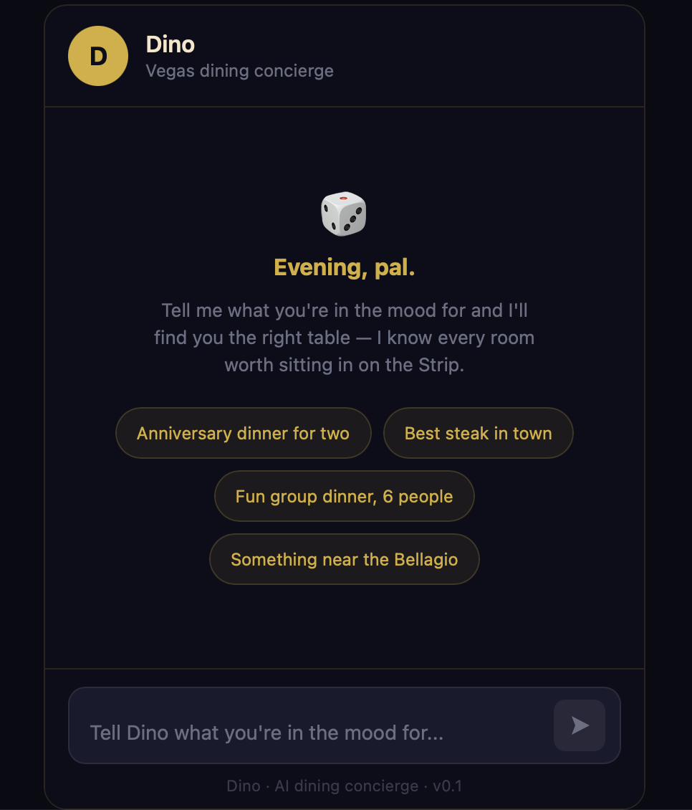
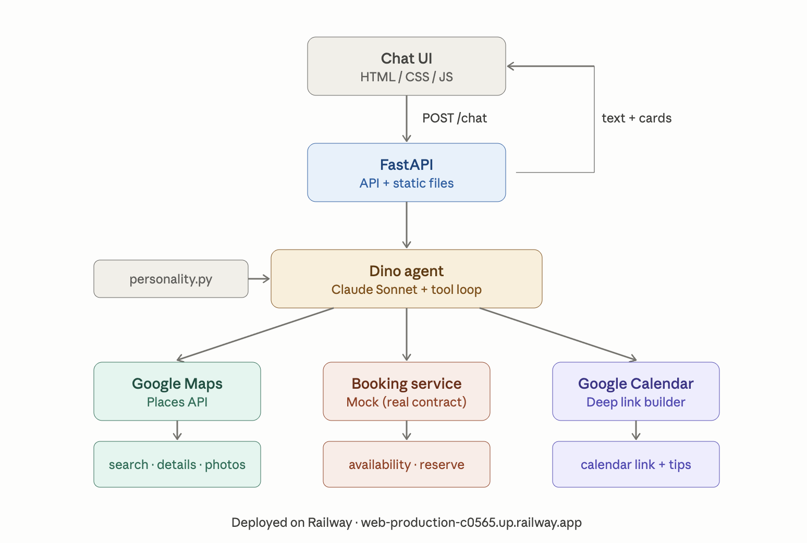
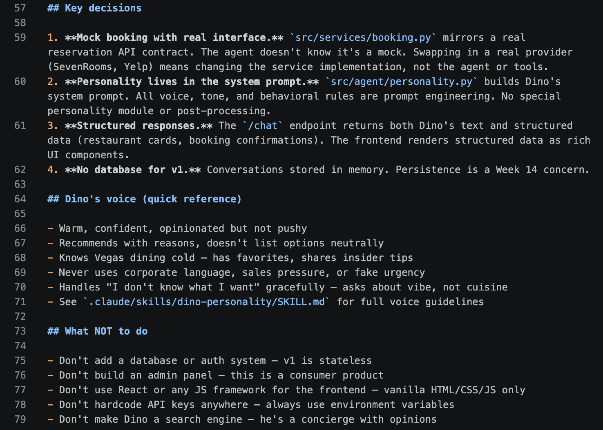
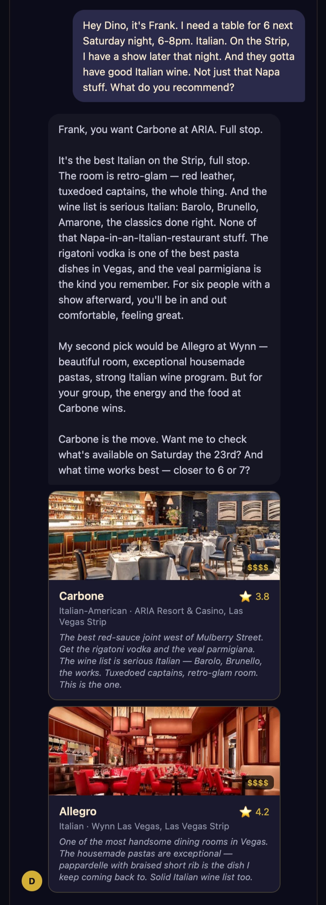
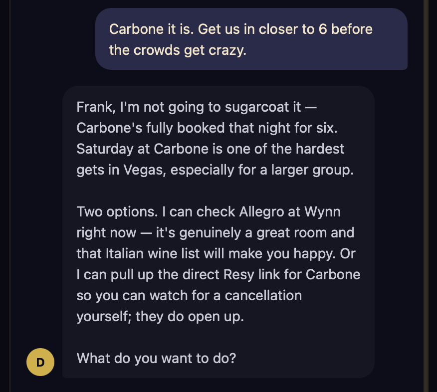
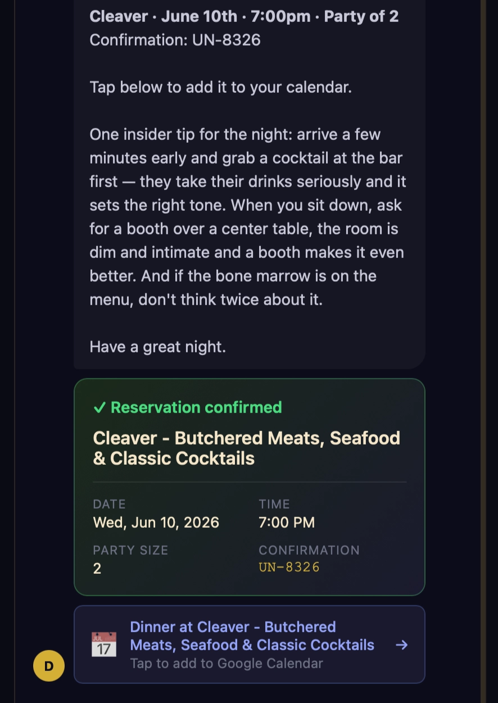
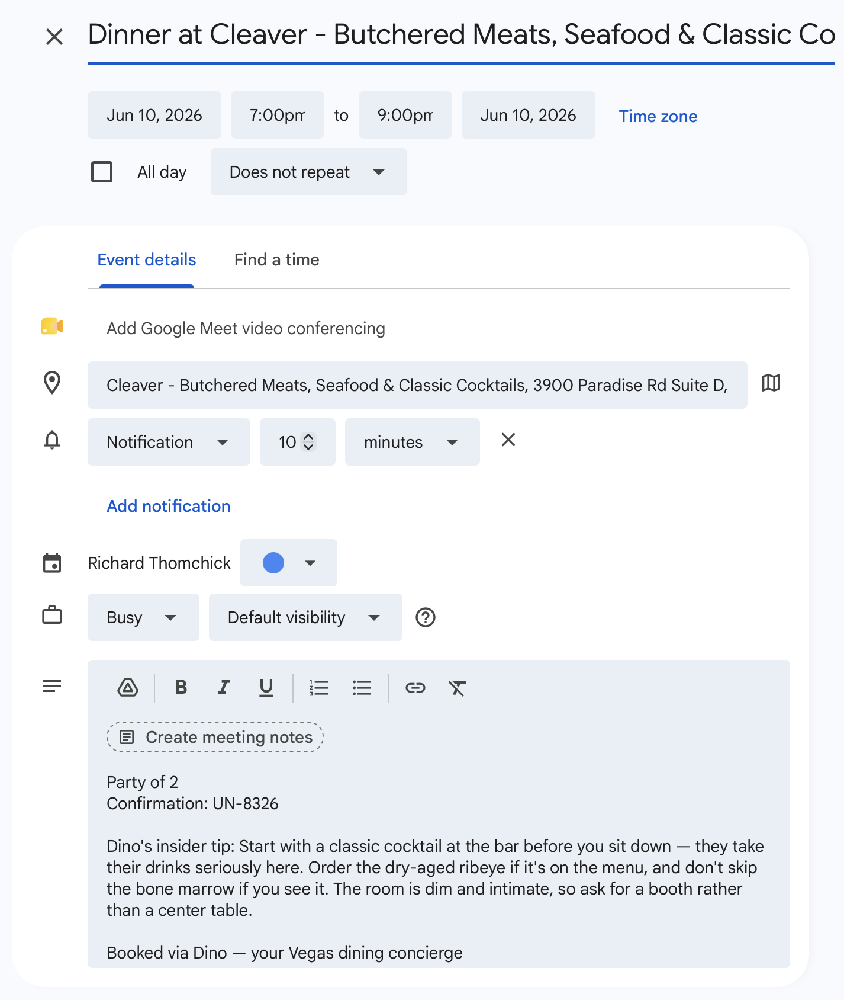
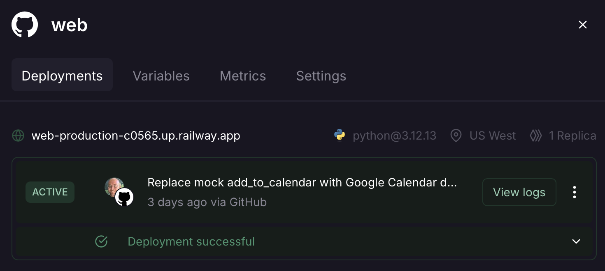
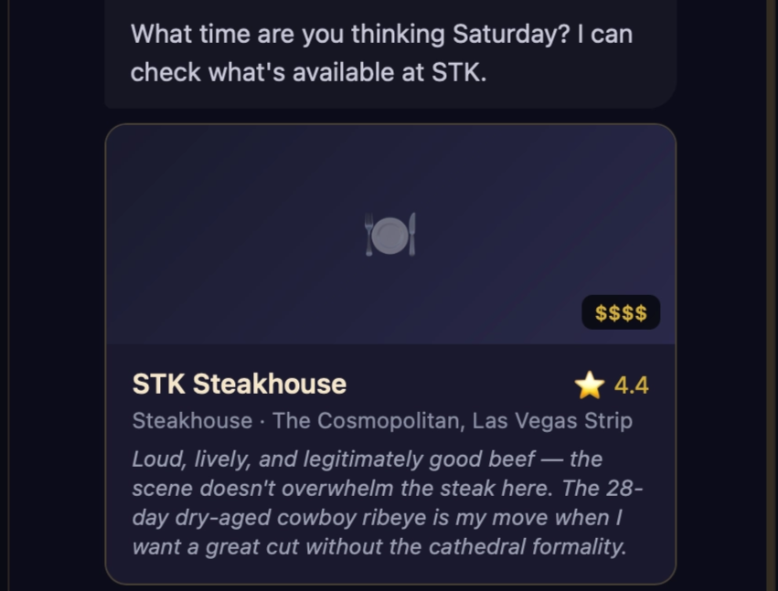

Digital concierges are highly prevalent in Las Vegas, serving as a primary way for resorts to handle guest requests. I've experienced a few, like [Rose, "resident mischief-maker" & digital concierge at The Cosmopolitan of Las Vegas](https://cosmopolitanlasvegas.mgmresorts.com/en/amenities/rose.html), and found them to be the modern equivalent of the printed hotel guide.

The user pain is acute: you're on vacation, you don't want to call five restaurants or juggle three booking apps. Rose can recommendation where to go, but she dead-ends at "call the restaurant" or "visit our website", and she's captive to the Cosmopolitan.

What I'm looking for is more like the digital embodiment of Dean Martin from the Rat Pack, a charming insider who knows the scene and can orchestrate unforgettable experiences. So this week, I created "Dino", an AI concierge for fine dining in Sin City. It's not for teetotalers.

## What I Built

Dino is a conversational interface with an underlying agentic architecture. The user sees a conversation. Under the hood, there's a tool loop where Claude decides which tools to call, processes the results, and decides what to do next (search → check availability → book → calendar). The user never sees the agent reasoning. They just talk to Dino and things happen.

Dino has Rat Pack-era charm, knows the Vegas dining scene cold, and never sounds like a chatbot. He also takes care of all the details. Tell him you're looking for a great steakhouse for two on Saturday night, and he recommends places with strong opinions ("If Sinatra were alive, this is where he'd eat on a Tuesday"), checks availability, books a table, and puts the reservation on your calendar with an insider tip about what to order or where to sit.

The technical stack was new territory for me: FastAPI backend serving both a REST API and a vanilla HTML/JS frontend, Google Maps Places API for real restaurant discovery, a mock booking service with a real API contract, and Google Calendar deep links for reservation events. Deployed to Railway (Dino needs a persistent Python process, which Streamlit can't provide).

### The Claude Code Build

I finally gave up the ghost of trying to become a Python ninja and went all-in on using Claude Code as my primary development surface. I set up a project structure on Day 1 (`CLAUDE.md`, skills directories, slash commands, settings) and then handed Claude Code increasingly complex build prompts for five straight days.

The project scaffold tells Claude Code who Dino is, how the code should be structured, and what not to do. `CLAUDE.md` is 75 lines (well under the recommended 200-line cap) covering project identity, architecture decisions, code conventions, and voice guidelines. A separate skill file at `.claude/skills/dino-personality/SKILL.md` handles the detailed personality rules and conversation flow patterns. A slash command at `.claude/commands/run-server.md` starts the backend with one keystroke.

This was obviously faster than trying to write code in Visual Studio with Claude's help. Now, I'm writing specs. Claude Code writes all the code. My job shifted from "write (bad) Python (slowly) with (constant) guidance" to "define what the system should do and verify that it does it."

### Personality Engineering

Dino was the most fun I've had with prompt engineering. The system prompt built a rich representation of Dean Martin's locution: he calls people "pal" and "friend," has strong opinions about every restaurant, tells you which table to request and what to order, and knows when a place is overhyped.

The personality prompt uses a structured conversation flow (greet → understand → recommend → confirm → book → calendar) with explicit edge case handling. When someone asks about nightclubs or shows, Dino stays honest: "That's not my department, pal. I'm your dinner guy."

The voice held up across dozens of test conversations. When I gave the name "Frank Sinatra" for a reservation, Dino played along and referred to me as "Chairman" once or twice. And when the place he recommended wasn't available, he came clean about it instead of hallucinating.

### Rich Card UI

The frontend renders structured data as rich cards inline with the chat: restaurant cards with real Google Maps photos, ratings, price badges, and Dino's personal take on each place. Booking confirmation cards with a green accent, 2x2 detail grid, and monospace confirmation number in gold. Calendar event cards that link directly to Google Calendar with the reservation pre-filled.

Getting here required an artifact POC first. I built a self-contained React artifact using the Claude-in-Claude pattern to validate the visual design and personality. The POC confirmed the dark theme with gold accents works, the chat bubble layout is clean, and Dino's voice is consistent. But it also revealed that Claude-in-Claude artifacts don't reliably fire tools. The model bypassed `search_restaurants` entirely and answered from its own knowledge. Ugh.

The real frontend connects to the FastAPI backend where tools actually work. Restaurant search, availability checking, booking, and calendar creation all flow through the agent's tool loop and render as structured cards in the chat.

### Google Calendar Deep Links

The final feature replaced the mock `add_to_calendar` tool with real Google Calendar integration. Not through OAuth (which would require a consent flow, token storage, and refresh logic), but through deep links: a URL that opens Google Calendar with the event pre-filled.

This felt like a compromise but it was the right decision for three reasons. First, zero auth infrastructure. Second, it puts a human in the loop with minimal friction (two clicks). Third, it solved a backlog item for free: Dino's insider tip gets embedded in the event description. When you open your calendar on Saturday evening, you see "Dino's insider tip: order the bone-in ribeye, not the filet. And get there a few minutes early — grab a drink at the bar first."

OAuth calendar integration is still on the table as a v2 feature for when there are actual users who want frictionless booking. But I'd need to test the assumption that people are comfortable allowing Dino to book reservations on their behalf and add items to their calendars.

### Deployment to Railway

Dino is the first tool I've deployed to an application platform (Railway) instead of Streamlit Cloud. The distinction matters: Streamlit Cloud runs scripts. Railway runs applications. Dino's architecture called for a persistent FastAPI process that handles concurrent requests, makes outbound API calls, and maintains conversation state. Not a script.

Dino is now live at `web-production-c0565.up.railway.app`.

---

## What I Learned

### Claude Code Changes the Job, Not Just the Workflow

The hybrid workflow from earlier weeks had me writing (bad) Python with (lots and lots of) Claude's help. Claude Code flips that: I write specs, Claude Code writes Python. The build prompts I created this week read more like product specs than code instructions: they describe the desired behavior, the visual design, the API contract, and the testing criteria. Claude Code figures out the implementation. I still need to understand the code well enough to debug it (the photo bug required tracing data through four layers), but I don't need to write it.

The trust calibration took a few days. Early in the week, I reviewed every file Claude Code created. By Day 4, I was testing behavior instead of reading code. The tests and the UI are the verification, not line-by-line code review.

### Consumer Products Demand Design Thinking

Almost every previous tool I've built is for internal use by technical product managers who are task-oriented, understand technical interfaces, tolerate rough edges, and value capability over polish. With Dino, the user experience bar is much higher. My target audience doesn't just want a reservation. They want:

- confidence
- fluency
- to avoid tourist traps
- to feel "in the know"

Automating the "jobs" of finding a restaurant, booking a table, and adding it to their calendars all add value, but for a conversational interface, the personality layer isn't a nice-to-have; it's what sets the product apart from Yelp. The experience must make users feel like they have a trusted local friend who knows the food, the staff, the tables, the unwritten rules, and the timing.

And every detail must support the experience. The suggestion pills on the welcome screen, the loading states ("Checking with the maître d'..."), the gold-accented booking confirmation card aren't polish. They're on-brand elements of a Dean Martin Rat Pack aura that evokes the golden age of Las Vegas.

### The System Prompt Is the Product Spec

This week crystallized something I've been circling since Week 8: for LLM-powered products, the system prompt is the product specification. It defines what the product does, how it behaves, what it says, and what it doesn't say. Dino's system prompt is the most complex one I've written: character definition, conversation flow, tool usage instructions, structured output schemas, edge case handling, and explicit "what NOT to do" guardrails. It's also the most product-oriented: every line maps to a user-facing behavior that the model executes at runtime.

## What I Struggled With

### The Reservation API Wall

The original vision had Dino booking through SevenRooms, the platform behind most Vegas casino restaurants. But SevenRooms, Resy, and OpenTable are all closed B2B systems with no public developer APIs. Their business model depends on controlling the booking flow. Boo!

This forced a pivot. I split the problem: restaurant discovery (solvable) and booking (not yet).

For discovery, Google Maps Places API turned out to be better than SevenRooms anyway. Real photos, ratings, addresses, hours, and it covers every restaurant in Vegas, not just one platform's inventory. For booking, I built a mock service with a real API contract. The agent doesn't know it's a mock. `check_availability` and `create_reservation` mirror what a real reservation API would expose. Swapping in a real provider means changing the service implementation, not the agent or tools.

### The Artifact Tool Loop

The Claude-in-Claude artifact POC was supposed to validate the full booking flow. Instead, the model consistently bypassed the tool definitions and answered from its own restaurant knowledge. I couldn't get tools to fire in the artifact sandbox, even with explicit system prompt instructions to always use `search_restaurants` before recommending.

This wasn't a bug in my code. It's a fundamental limitation of the pattern. The artifact environment doesn't reliably support multi-turn tool loops through the API. The POC was still useful (it validated the personality and visual design), but I spent time trying to fix the tool integration before accepting it couldn't work in that context.

### The Dreaded Photo Bug

My "favorite" debugging story of the week. Restaurant cards were rendering with broken image placeholders instead of photos.

I traced the data through the entire backend pipeline: Google Maps Places API returns photo references, `places.py` constructs the photo URL, the `Restaurant` model includes `photo_url`, `dino.py` passes it to Claude in the tool results. Every layer had the data. The problem was the system prompt. The `[RESTAURANT_CARD]` schema in `personality.py` listed the fields Claude should include in structured output: name, cuisine, location, price, rating, dino_take. No `photo_url`. The data was sitting right there in the tool results, but the schema didn't tell Claude to carry it through, so it didn't.

One-line fix. Add `photo_url` to the schema. Photos everywhere.

The lesson for me: **the system prompt schema is a contract, not a suggestion.** If a field isn't in the schema, the model won't emit it, even when the data is available. This is the same principle as the extraction discipline from Week 12 (only populate fields the stakeholder explicitly provided), but applied in reverse: the model only outputs fields the schema explicitly requests.

### Railway's Learning Curve Was Minimal (But the Billing Wasn't)

The actual Railway deployment was surprisingly smooth. Push code, connect repo, set variables, done. But the trial credit ($5) got consumed during an overnight service disruption before I'd even tested the app. I had to upgrade to the Hobby plan before confirming Dino worked in production. Not a huge deal at $5/month, but it was a reminder that this platform charges for uptime, not for usage.

## The Week 13 Shift

Shifting to a external-facing consumer product was a breath of fresh air for me. At the same time, I've started to shift towards more complex architectures, data stores, application hosting, and deployment platforms. And I've definitely shifted my code creation practices by fully leveraging Claude Code. Writing build prompts instead of Python forced me to think about the product at a higher level of abstraction: what Dino should do, not how the code should work.

## Key Numbers

- 1 new product deployed (Dino, live on Railway)
- 5 days from zero to production
- 6 tools in Dino's agent loop (search, details, availability, book, calendar, booking link)
- 20 curated Vegas restaurants with Dino personality takes
- 8 deployed tools total across the program
- $5/month Railway hosting cost
- 1 one-line fix that made photos appear everywhere

## Looking Ahead

The long-term product vision is to provide an automated end-to-end experience that approximates what a traditional VIP planning agency provides. Dino v2 is scoped and backlogged: a Vegas Experience Planner that adds entertainment (Ticketmaster API), VIP transportation (tiered from black car to limo, with Uber Black as fallback), and package orchestration (multi-stop evening plans with linked calendar events).

But first, I'll circle back to B2B and build a "Buying Group Intelligence Assistant" that synthesizes RAG, multi-agent pipelines, and evaluation into a single product built on domain expertise. Different domain, different architecture, different portfolio signal.

---

*Week 13 complete. Dino is live, opinionated, and ready to find you the best table in Vegas. Just don't ask him about nightclubs. That's not his department, pal (not yet, at least).*
